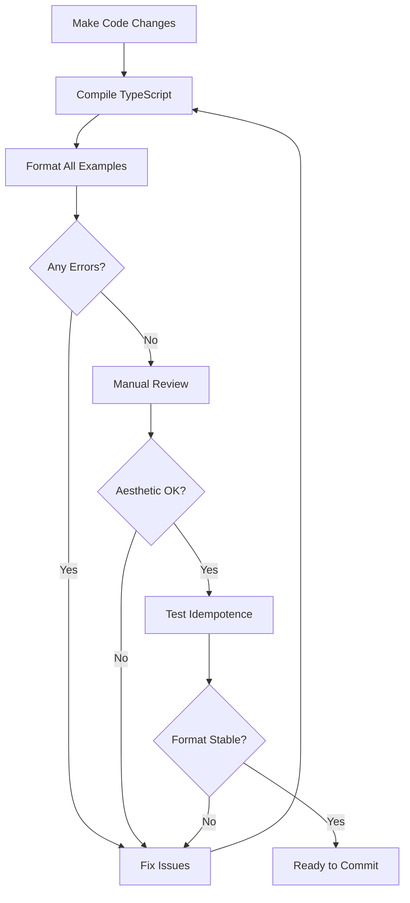

# Quick Testing Guide

## 🚀 How to Test the Formatter

### Manual Aesthetic Testing

1. **Format all examples**:
   ```bash
   # Open VS Code
   # For each file in examples/:
   # - Open the file
   # - Right-click → Format Document (or Shift+Option+F / Shift+Alt+F)
   # - Review the output
   ```

2. **Check for issues**:
   - ✅ Aliases aligned consistently?
   - ✅ Comments aligned consistently?
   - ✅ Keywords cased correctly (lowercase select/from, uppercase CASE/WHEN/etc)?
   - ✅ Leading commas formatted properly?
   - ✅ Indentation consistent (4 spaces default)?
   - ✅ No trailing whitespace?
   - ✅ Semicolons placed correctly?

3. **Document problems**:
   - Note file name and line number
   - Describe expected vs actual output
   - Add to GitHub issues or fix immediately

### Idempotence Testing

```bash
# For each example file:
# 1. Format once
# 2. Copy the output
# 3. Format again
# 4. Compare: should be identical
```

**Quick shell script**:
```bash
# Test idempotence (requires formatter to be installed)
for file in examples/*.sql; do
  echo "Testing $file"
  # Format twice and compare
  # (This requires VS Code CLI or test harness - to be built)
done
```

### Execution Safety Testing

**When available** (requires test database setup):
```bash
npm run test:execution
```

This will:
1. Execute original SQL → capture results
2. Format the SQL
3. Execute formatted SQL → capture results
4. Compare: must be identical

### Quick Checklist Before Merging

- [ ] All 8 example files format without errors
- [ ] Manual review completed
- [ ] No aesthetic issues found (or documented in issues)
- [ ] Idempotence verified (format twice = same result)
- [ ] No syntax errors introduced
- [ ] Comments preserved and aligned
- [ ] Documentation updated if behavior changed

## 📁 Example Files Reference

| File | Test Cases | Focus Area |
|------|------------|------------|
| `01-basic-queries.sql` | 18 | Simple SELECT, WHERE, GROUP BY, ORDER BY |
| `02-ctes-subqueries.sql` | 13 | CTEs, subqueries, derived tables |
| `03-joins.sql` | 19 | All JOIN types, USING clauses, complex ON |
| `04-expressions.sql` | 25+ | CASE, window functions, nested functions |
| `05-spark-specific.sql` | 30+ | Databricks/Spark: named_struct, LATERAL VIEW, etc |
| `06-dml-ddl.sql` | 35+ | INSERT, UPDATE, DELETE, MERGE, CREATE, ALTER |
| `07-comments-strings.sql` | 30+ | Comment alignment, SQL keywords in strings |
| `08-edge-cases.sql` | 50+ | Deep nesting, long lines, unusual whitespace |

**Total**: 200+ test cases

## 🔧 Common Issues to Watch For

### Execution-Breaking Changes
- ❌ Semicolon inserted between `WITH` and query
- ❌ Quotes broken or escaped incorrectly
- ❌ Keywords split across lines incorrectly
- ❌ Parentheses unbalanced

### Aesthetic Issues
- ⚠️ Aliases misaligned
- ⚠️ Comments misaligned or wrapped incorrectly
- ⚠️ Inconsistent indentation
- ⚠️ Leading commas have incorrect spacing
- ⚠️ Trailing whitespace added

### Idempotence Issues
- ⚠️ Second format changes output
- ⚠️ Oscillation between two states
- ⚠️ Alignment shifts on re-format

## 🎯 Testing Workflow



## 💡 Tips

1. **Start small**: Test with 01-basic-queries.sql first
2. **Check incrementally**: After each pass change, test all examples
3. **Use diff tools**: Compare before/after formatting with git diff
4. **Save golden files**: Keep "correct" formatted versions for comparison
5. **Test real SQL**: Use SQL from your actual projects

## 🚨 Red Flags

Stop and investigate if you see:
- Syntax errors after formatting
- Lost comments
- Different results between format passes
- Broken CTE structure
- Semicolons in wrong places

## 📊 Test Coverage Status

See `TESTING_STATUS.md` for current progress and next steps.

See `TESTING_PLAN.md` for comprehensive testing strategy.
